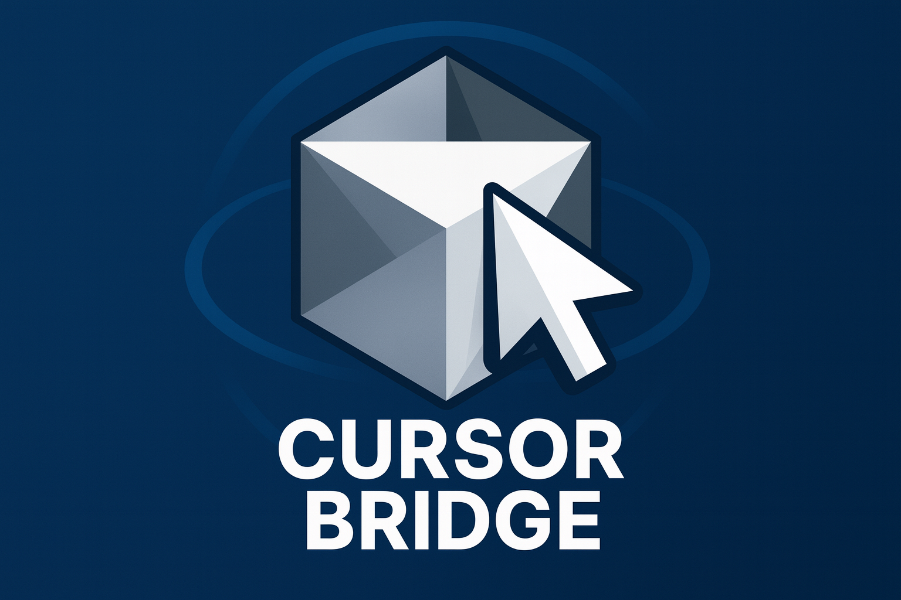

<div align="center">
  
</div>

# 🚀 CursorBridge MCP

> Turn your AI into a browser-savvy superhero! 🦸‍♂️

Ever wished your AI could actually *see* what's happening in your browser? Well, wish no more! CursorBridge MCP is like giving your AI a pair of super-powered glasses that let it peek into your browser, take screenshots, and even run audits on your web pages. It's basically browser telepathy for your coding assistant! 🧠✨

This nifty little tool uses Anthropic's Model Context Protocol (MCP) to turn your AI into a browser whisperer that can capture, analyze, and interact with everything happening in your Chrome tabs.

## 🎉 What's New in 1.0.0!

Hold onto your hats, folks! We've just dropped 1.0.0 and it's absolutely *chef's kiss* 👨‍🍳💋 Here's what's cooking:

- 🎯 **Auto-Paste Magic**: Enable "Allow Auto-Paste into Cursor" in the DevTools panel and watch screenshots magically appear in Cursor! (Pro tip: click into the Agent input field first, or the magic won't work! ✨)
- 🔍 **Lighthouse Suite**: We've integrated a whole arsenal of SEO, performance, accessibility, and best practice analysis tools. Your AI is now basically a web development detective! 🕵️‍♀️
- ⚡ **NextJS Superpowers**: Added a NextJS-specific prompt to turbocharge your SEO game. Because why settle for good when you can be *amazing*?
- 🐛 **Debugger Mode**: A new tool that runs all debugging tools in sequence with a reasoning prompt. It's like having a debugging sidekick! 🦸‍♀️
- 🔍 **Audit Mode**: Execute all auditing tools in one go. Because who has time to run them one by one? ⏰
- 🪟 **Windows Fixes**: Resolved those pesky Windows connectivity issues. No more "it works on my machine" moments! 
- 🌐 **Smarter Networking**: Improved communication between all our components with auto-discovery, auto-reconnect, and graceful shutdown. It's like having a really polite butler! 🤵
- ⌨️ **Easy Exit**: Added Ctrl+C support to gracefully exit the server. Because sometimes you just need to get out fast! 🏃‍♂️💨

## 📋 Requirements

Before we start this adventure, make sure you have:

- 🟢 **NodeJS installed** on your machine (the foundation of everything!)
- 🌐 **Google Chrome or a Chromium-based Browser** (required for audit functionality!)
- 🤖 **MCP Client Application** (Cursor, Windsurf, RooCode, Cline, Continue, Zed, Claude Desktop)

**Note**: Model Context Protocol (MCP) is specific to Anthropic models. When using an editor like Cursor, make sure to enable composer agent with Claude 3.5 Sonnet selected as the model.

## 🛠️ Installation (Let's Get This Party Started!)

### 1. 📥 Download & Install the Chrome Extension

The official chrome extension is pending approval on the Google extension marketplace. For now, you can:

**Option A**: Download from our repository
- Clone the repo and find the extension within the `cursor-bridge-extension` directory:

```bash
git clone https://github.com/MantisWare/cursor-bridge.git
```

**Option B**: Download the extension directly
- Click here to download the extension (link coming soon!)

**Installation Steps:**

**1a.** Open 'Manage Extensions' 🎛️
- Open the Manage Extensions Screen

**1b.** Enable 'Developer Mode' and click 'Load unpacked' 🔧
- Manage & Load Chrome Extensions

**1c.** Navigate to the chrome extension folder downloaded earlier, make sure it's unzipped and click 'Select'. You should see **CursorBridge MCP** in your list of extensions now! 🎉

### 2. ⚙️ Setup CursorBridge MCP Tool in Your IDE

Setup CursorBridge MCP server in your favorite MCP client. Here's how to set this up inside of Cursor:

**2a.** Go to your 'Cursor Settings' ⚙️
- Open Cursor Settings

**2b.** Go to Features, scroll down to MCP Servers and click on 'Add new MCP server' 🆕
- Go to Cursor Features

**2c.** Give it a unique name (cursor-bridge), set type to 'command' and set command to:

**MacOS:**
```bash
npx @mantisware/cursor-bridge-mcp@latest
```

**Windows:**
```bash
npx @mantisware/cursor-bridge-mcp@latest
```

If using NPX on Windows, use this command to find the path to NPX:
```bash
which npx
```

**2d.** Confirm that the MCP server has been connected. You should see all the tools listed and a green circle next to the tool name. 🟢
- Wait a few seconds or click on the refresh button a few times if it does not register. If it still won't register make sure you entered the right command.

For more on this, check out the docs for these MCP clients:
- [Cursor](https://cursor.sh/)
- [Windsurf](https://codeium.com/windsurf)
- [Zed](https://zed.dev/)
- [RooCode](https://roocode.com/)
- [Cline](https://cline.ai/)
- [Claude Desktop](https://claude.ai/desktop)
- [LibreChat](https://librechat.ai/)

### 3. 🖥️ Run the CursorBridge Server

Aggregates logs from the chrome extension and sets up websockets for screenshot capture. Run this from your terminal within any directory:

```bash
npx @mantisware/cursor-bridge-server@latest
```

**Note**: The cursor-bridge-server runs on port 3035. Make sure to terminate any processes running on this port. In a future release, we will handle this gracefully.

### 4. 🔍 Open the Chrome Developer Console

Right click on any web page and click 'Inspect' to open the Chrome dev tools. Once open, logs will be accessible to the MCP client.

You can navigate to the CursorBridge panel to:
- 📸 Manually capture a screenshot
- 📁 Define a path to save screenshots to (defaults to: `./screenshots` in your project root)
- 🧹 Wipe all saved logs
- ⚙️ Modify logging size limits / truncation

**Note**: Logs will be wiped from the server everytime you refresh the page. You can manually wipe the logs by clicking the 'Wipe Logs' button in the CursorBridge panel.

## 🎉 Congratulations!

**You've successfully installed and configured CursorBridge MCP!** 🎉

After these steps, open Chrome DevTools and look for the CursorBridgeMCP panel. It's like finding a hidden treasure! 🏴‍☠️

## 🆘 Troubleshooting (AKA "Help, It's Not Working!")

Sometimes things go sideways, but we're here to help! Here are few common gotchas and steps you can take to get CursorBridge up and running:

1. ✅ Check to see if you've installed the MCP server into Cursor correctly
2. ✅ Make sure you're running the **@mantisware/cursor-bridge-server@latest** command in a new terminal
3. ✅ Make sure you've installed the chrome extension and opened chrome dev tools in the tab you want to capture logs from
4. ✅ If none of this works double-check the common gotchas below

And if you're STILL stuck... 🤔

1. Run this command in a new terminal to monitor the Cursor MCP logs:

```bash
tail -n 20 -F ~/Library/Application\ Support/Cursor/**/*MCP.log
```

2. Take a screenshot of those logs, a screenshot of the node server logs from cursor-bridge-server and if possible - go into the manage extensions window in chrome and click on an error button if present in the extension we installed earlier to capture a screenshot of that too

3. Contact [@tedx_ai on X](https://x.com/tedx_ai) or add an issue to the Github repo with all the requested details and we'll get back to you as soon as possible!

### 🐛 Common Issues & Errors

#### Error: Screenshot tool is failing 📸

Cursor and some other MCP clients may not always fetch the correct version of the MCP server. Make sure to use `npx @mantisware/cursor-bridge-mcp@latest` instead to explicitly use the latest working version.

#### Issue: Cannot see my screenshots 📁

Screenshots will be default be saved to a `screenshots` folder in your project root directory. The folder will be created automatically if it doesn't exist! Make sure to check there for the screenshots. Otherwise, you can add a custom path to save screenshots to in the CursorBridge dev tools panel. We suggest creating a screenshots folder in your current project, right click on the folder and click on 'copy path'. Then paste that into the dev tools panel and press enter.

#### Issue: Not seeing any logs 📝

Make sure to open the chrome dev tools console in the browser tab that you want to capture logs from.

#### Issue: Seeing too many logs 📊

Close down any other tabs that have the chrome dev tools open. CursorBridge will capture logs across many tabs.

#### Issue: Logs keep disappearing! 🧹

Anytime you refresh the page or restart the node process running the cursor-bridge-server, your logs will be wiped.

#### Failed to send log to browser-connector? 🔌

You might have chrome dev tools / the inspector window open in other tabs! Closing those panels in each tab, then refreshing the tab of the project you're working on should fix this!

#### Issue: Encountering an unknown error ❓

Contact [@tedx_ai](https://x.com/tedx_ai) or add an issue to the Github repo.

## ⚙️ Cursor IDE Configuration (The Setup Magic!)

Ready to configure Cursor IDE? Here's exactly what your MCP configuration should look like! 🎯

### 📝 Cursor MCP Configuration

Add this configuration to your Cursor IDE settings. You can find the MCP settings in Cursor's preferences:

**For NPX (Recommended - Always Latest):**
```json
{
  "mcpServers": {
    "cursor-bridge-mcp": {
      "command": "npx",
      "args": ["@mantisware/cursor-bridge-mcp@latest"],
      "env": {}
    }
  }
}
```

**For Local Development:**
```json
{
  "mcpServers": {
    "cursor-bridge-mcp": {
      "command": "node",
      "args": ["/path/to/your/cursor-bridge-mcp/dist/mcp-server.js"],
      "env": {}
    }
  }
}
```

### 🔧 Alternative Configuration Options

**With Custom Environment Variables:**
```json
{
  "mcpServers": {
    "cursor-bridge-mcp": {
      "command": "npx",
      "args": ["@mantisware/cursor-bridge-mcp@latest"],
      "env": {
        "DEBUG": "cursor-bridge:*",
        "PORT": "3001"
      }
    }
  }
}
```

**For Development with Local Files:**
```json
{
  "mcpServers": {
    "cursor-bridge-mcp": {
      "command": "npx",
      "args": ["tsx", "/path/to/your/cursor-bridge-mcp/mcp-server.ts"],
      "env": {
        "NODE_ENV": "development"
      }
    }
  }
}
```

### 🎯 Pro Tips for Configuration! 

- 🚀 **Use NPX**: The `npx` approach automatically gets the latest version - no manual updates needed!
- 🔄 **Restart Cursor**: After adding the MCP configuration, restart Cursor IDE to activate the connection
- 🐛 **Debug Mode**: Add `"DEBUG": "cursor-bridge:*"` to the env section for detailed logging
- 📁 **Local Path**: Replace `/path/to/your/cursor-bridge-mcp/` with your actual project path

### ✅ **Verification Step (Test Your Setup!)**

Once you've configured everything, test that your MCP connection is working! 🧪

**Test Command:**
```
Can you check if you can access my console logs with the cursor bridge tool?
```

If everything is set up correctly, your AI should be able to access the CursorBridge MCP tools and respond with something like this:

<div align="center">
  
</div>

**What to Expect:**
- 🤖 Your AI should recognize and use the CursorBridge MCP tools
- 📊 You should see tool calls being made to access browser data
- 🎯 The AI should be able to retrieve console logs, network data, or take screenshots
- ✨ If successful, you'll see the MCP tools in action!

**If It's Not Working:**
- 🔄 Make sure both servers are running (`cursor-bridge-server` and `cursor-bridge-mcp`)
- 🌐 Ensure you have an active browser tab with the CursorBridge extension enabled
- 🔌 Check that the Chrome extension is connected (look for the CursorBridgeMCP panel in DevTools)
- 🚀 Try restarting Cursor IDE after adding the MCP configuration

### 🆘 Troubleshooting (AKA "Help, It's Not Working!")

If things go sideways, try this troubleshooting dance:
- 🚪 **Close Chrome Completely**: Not just the window, but the whole browser. Give it a proper goodbye!
- 🔄 **Restart the Server**: Give your cursor-bridge-server a fresh start
- 🎯 **One Panel Only**: Make sure you only have ONE DevTools panel open (no cheating!)

Still stuck? Don't worry, we've got your back! Open an issue ticket and we'll figure this out together! 🤝

Got questions, ideas, or just want to say hi? Hit me up at [@tedx_ai on x](https://x.com/tedx_ai) or open an issue ticket! We love hearing from you! 💌

## 🎊 The Full Update Story

Picture this: Your coding agents (like Cursor) can now run these audits against any page without breaking a sweat! By teaming up with Puppeteer and the Lighthouse npm library, CursorBridge MCP has become the ultimate web development sidekick! 🦸‍♀️

Here's what your AI can now do (while you sip your coffee ☕):

- 🎯 **WCAG Compliance Checker**: Make sure your pages are accessible to everyone (because inclusivity is cool!)
- ⚡ **Performance Detective**: Hunt down those sneaky bottlenecks that slow down your site
- 🔍 **SEO Sleuth**: Flag on-page SEO issues before they become problems
- ✅ **Best Practices Enforcer**: Check if you're following web development best practices (no judgment, just helpful nudges!)
- ⚛️ **NextJS Specialist**: Review NextJS-specific SEO issues with laser precision

...and the best part? All of this happens without you ever leaving your IDE! It's like having a super-powered intern that never needs coffee breaks! 🚀

---

## 🔑 The Superpowers We Added

| 🦸‍♀️ Superpower      | What It Does (In Human Terms)                                                                                                            |
| ------------------ | ---------------------------------------------------------------------------------------------------------------------------------------- |
| **🎯 Accessibility**  | Makes sure your site is friendly to everyone - checks color contrast, missing alt text, keyboard navigation, ARIA attributes, and more! |
| **⚡ Performance**    | Plays detective with your page speed - hunts down render-blocking resources, excessive DOM size, unoptimized images, and other speed killers! |
| **🔍 SEO**            | Turns your AI into an SEO guru - evaluates metadata, headings, link structure, and gives you the inside scoop on search visibility!      |
| **✅ Best Practices** | Your friendly neighborhood code reviewer - checks if you're following web development best practices (with love, not judgment!).                    |
| **⚛️ NextJS Audit**   | Special NextJS powers activated! Injects prompts specifically designed for NextJS audits.                                                                                         |
| **🔍 Audit Mode**     | The "run everything" button - executes all auditing tools in one glorious sequence!                                                                                                   |
| **🐛 Debugger Mode**  | The debugging dream team - runs all debugging tools in perfect harmony!                                                                                                  |

---

## 🛠️ How to Use These Awesome Tools

### ✅ **Pre-Flight Checklist** (AKA "Are You Ready?")

Before we start this adventure, make sure you have:

- 🌐 An **active tab** in your browser (this is where the magic happens!)
- 🔌 The **CursorBridge extension enabled** (your AI needs its eyes!)

### ▶️ **Let's Run Some Audits!** (The Fun Part)

**🤖 Headless Browser Magic**:  
Puppeteer creates a headless Chrome instance (think of it as an invisible browser) that loads your page and collects all the juicy audit data. It's like having a super-fast, invisible intern that works 24/7!

The headless browser stays awake for **60 seconds** after your last audit call, so it's ready for your next request without any startup delays. Talk about efficiency! ⚡

**📊 Beautifully Structured Results**:  
Each audit returns results in a clean, organized JSON format with overall scores and detailed issue lists. It's like getting a report card for your website, but way more helpful! Your MCP-compatible clients can easily understand and present these findings as actionable insights.

The MCP server gives you tools to run audits on whatever page you're currently viewing. Here are some example queries to get you started (think of them as conversation starters with your AI!):

#### 🎯 Accessibility Audit (`runAccessibilityAudit`)

Makes sure your page is friendly to everyone! Ensures the page meets accessibility standards like WCAG (because everyone deserves a great web experience!).

> **💬 Chat with Your AI:**
>
> - "Are there any accessibility issues on this page?"
> - "Run an accessibility audit."
> - "Check if this page meets WCAG standards."

#### ⚡ Performance Audit (`runPerformanceAudit`)

Hunts down those sneaky performance bottlenecks and loading issues that make users go "ugh, this is slow!"

> **💬 Chat with Your AI:**
>
> - "Why is this page loading so slowly?"
> - "Check the performance of this page."
> - "Run a performance audit."

#### 🔍 SEO Audit (`runSEOAudit`)

Turns your AI into an SEO guru! Evaluates how well the page is optimized for search engines (because we all want to be found on Google!).

> **💬 Chat with Your AI:**
>
> - "How can I improve SEO for this page?"
> - "Run an SEO audit."
> - "Check SEO on this page."

#### ✅ Best Practices Audit (`runBestPracticesAudit`)

Your friendly neighborhood code reviewer! Checks for general best practices in web development (with love, not judgment!).

> **💬 Chat with Your AI:**
>
> - "Run a best practices audit."
> - "Check best practices on this page."
> - "Are there any best practices issues on this page?"

#### 🔍 Audit Mode (`runAuditMode`)

The "run everything" button! Executes all audits in a beautiful sequence. Will automatically run a NextJS audit if it detects you're using NextJS (how smart is that?).

> **💬 Chat with Your AI:**
>
> - "Run audit mode."
> - "Enter audit mode."

#### ⚛️ NextJS Audits (`runNextJSAudit`)

Special NextJS powers activated! Checks for best practices and SEO improvements specifically for NextJS applications (because NextJS deserves special treatment!).

> **💬 Chat with Your AI:**
>
> - "Run a NextJS audit."
> - "Run a NextJS audit, I'm using app router."
> - "Run a NextJS audit, I'm using page router."

#### 🐛 Debugger Mode (`runDebuggerMode`)

The debugging dream team! Runs all debugging tools in perfect harmony (like a symphony, but for debugging!).

> **💬 Chat with Your AI:**
>
> - "Enter debugger mode."

## 🏗️ The Architecture (AKA "How the Magic Happens")

Meet the three musketeers that make all this browser magic possible! 🎭

1. **🔌 Chrome Extension**: Your browser's new best friend! Captures screenshots, console logs, network activity, and DOM elements (it's like having a super-powered spy in your browser!).
2. **🖥️ Node Server**: The ultimate middleman! Facilitates communication between the Chrome extension and any MCP server (think of it as a really good translator!).
3. **🤖 MCP Server**: The brain of the operation! A Model Context Protocol server that gives AI clients standardized tools to interact with your browser (it's like teaching your AI a new language!).

```
┌─────────────┐     ┌──────────────┐     ┌───────────────┐     ┌─────────────┐
│  MCP Client │ ──► │  MCP Server  │ ──► │  Node Server  │ ──► │   Chrome    │
│  (e.g.      │ ◄── │  (Protocol   │ ◄── │ (Middleware)  │ ◄── │  Extension  │
│   Cursor)   │     │   Handler)   │     │               │     │             │
└─────────────┘     └──────────────┘     └───────────────┘     └─────────────┘
```

**🧠 What's MCP?** Model Context Protocol (MCP) is Anthropic's superpower that lets you create custom tools for any compatible AI client. MCP clients like Claude Desktop, Cursor, Cline, or Zed can run an MCP server that "teaches" these clients about new tools they can use. It's like giving your AI a new skill! 🎓

**🔒 Privacy First!** These tools can call out to external APIs, but in our case, **all logs are stored locally** on your machine and NEVER sent to any third-party service or API. CursorBridge MCP runs a local NodeJS API server that communicates with the CursorBridge Chrome Extension. Your data stays with you! 🛡️

All consumers of the CursorBridge MCP Server interface with the same NodeJS API and Chrome extension. It's like having a universal translator for browser data! 🌍

#### 🔌 Chrome Extension (The Browser Spy)

- 👀 **Monitors Everything**: Keeps an eye on XHR requests/responses and console logs (it's like having a really attentive assistant!)
- 🎯 **Tracks Elements**: Watches selected DOM elements like a hawk
- 📤 **Sends Data**: Ships all logs and current elements to the CursorBridge Connector
- 📸 **Screenshot Magic**: Connects to Websocket server to capture and send screenshots
- ⚙️ **User Control**: Lets you configure token/truncation limits and screenshot folder paths (because you're the boss!)

#### 🖥️ Node Server (The Ultimate Middleman)

- 🤝 **Perfect Translator**: Acts as middleware between the Chrome extension and MCP server
- 📥 **Data Receiver**: Gets logs and currently selected elements from the Chrome extension
- 🔄 **Request Processor**: Handles MCP server requests for logs, screenshots, or current elements
- 📸 **Screenshot Commander**: Sends Websocket commands to the Chrome extension for capturing screenshots
- ✂️ **Smart Truncator**: Intelligently cuts down strings and duplicate objects in logs to avoid token limits (it's like having a really smart editor!)
- 🛡️ **Privacy Guardian**: Removes cookies and sensitive headers to keep your data safe from LLMs

#### 🤖 MCP Server (The Brain)

- 🧠 **Protocol Master**: Implements the Model Context Protocol like a pro
- 🛠️ **Tool Provider**: Gives AI clients standardized tools to work with
- 🌍 **Universal Compatibility**: Works with various MCP clients (Cursor, Cline, Zed, Claude Desktop, etc.) - it's like speaking every AI language!

## 📦 Installation

Ready to get started? Installation steps can be found in our documentation:

- [CursorBridge MCP Docs](installation.md) 📚

## 🎮 Usage (The Fun Part!)

Once you've got everything installed and configured, your AI becomes a browser superhero! Any compatible MCP client can now:

- 👀 **Monitor Console Output**: Keep an eye on what's happening in your browser console
- 🌐 **Capture Network Traffic**: See all the data flowing in and out of your page
- 📸 **Take Screenshots**: Capture the current state of your page (perfect for debugging!)
- 🔍 **Analyze Elements**: Dive deep into selected DOM elements
- 🧹 **Clean Up**: Wipe logs stored in the MCP server when you need a fresh start
- 🎯 **Run Audits**: Execute accessibility, performance, SEO, and best practices audits (the whole shebang!)

## 🌟 Compatibility

- ✅ **Universal MCP Support**: Works with any MCP-compatible client
- 🎯 **Cursor IDE Optimized**: Primarily designed for Cursor IDE integration (but plays well with others!)
- 🤝 **Friendly with All**: Supports other AI editors and MCP clients (we're not picky!)
